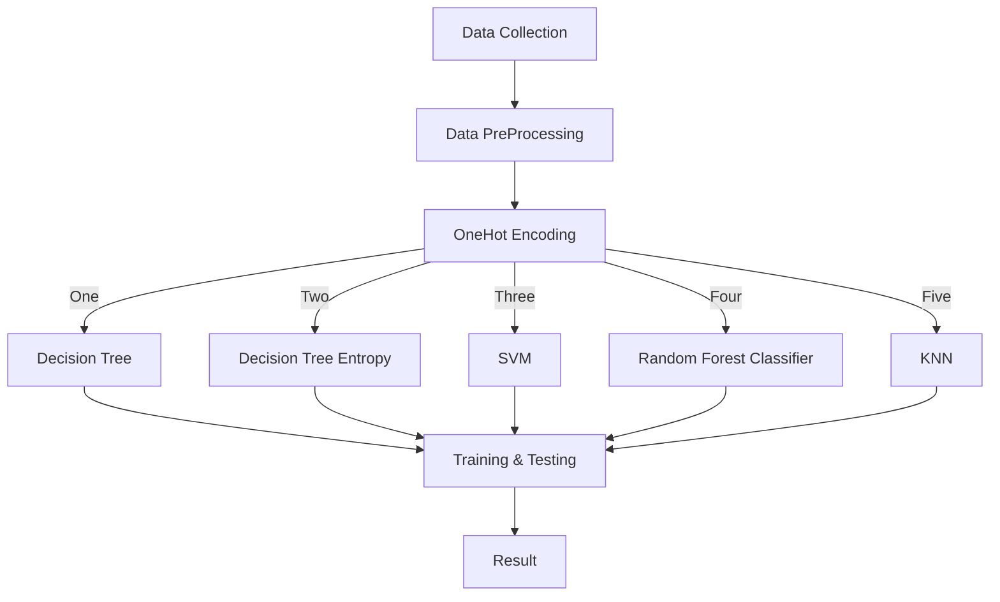

# MargDarshan

## _Automate the Career advice which is suitable for the Engineering Students_

> Click here to explore ✨ [ MargDarshan](https://noobbytes.herokuapp.com/) ✨

> [Demostration Video](https://youtu.be/w3rM3Vjrhqo)

The problem can be countered by a Machine Learning based “Career Guidance System”.

#### Our Assumptions **_(Primarily for engineering students)_**:

For the solution following assumptions have been made :

- Students should have interest and vision(Management/Technical).
- Students personality, skills.
- Students should provide his past performances.

#### And we have taken 38 parameters:

Our Parameters

  

      * Academic percentage in Operating Systems
      * Academic percentage in Algorithms
      * Academic percentage in Programming Concepts
      * Academic percentage in Software Engineering
      * Academic percentage in Computer Networks
      * Academic percentage in Electronics Subjects
      * Academic percentage in Computer Architecture
      * Academic percentage in Mathematics
      * Academic percentage in Communication skills
      * Hours working per day
      * Logical quotient rating
      * Hackathons
      * Coding skills rating
      * Public speaking points
      * Can work for a longer time before the system?
      * Self-learning capability?
      * Extra-courses did
      * Certifications
      * Workshops
      * Talent tests taken?
      * Olympiads
      * Reading and Writing skills
      * Memory capability score
      * Interested subjects
      * Interested career area
      * Job/Higher Studies?
      * Type of company want to settle in?
      * Taken inputs from seniors or elders
      * Interested in games
      * Interested Type of Books
      * Salary Range Expected
      * In a Relationship?
      * Gentle or Tuff behaviour?
      * Management or Technical
      * Salary/work
      * Hard/Smart worker
      * Worked in teams ever?
      * Introvert

#### Existing System :

Currently, engineering students mostly rely on seniors, mentors, professors, and parents for career guidance. Some may also seek guidance from counsellors.

##### Drawbacks of this method :

- But the outcome can be influenced by the counsellor’s personal interests and lack of knowledge about the various courses.
- It is difficult to find qualified and trustworthy career counsellors and some people cannot afford costs for counselling.
- There might be uncertainties. It is not sure or guaranteed for the desired outcome.

#### Our Solution:

Our proposed idea of the MargDarshan system takes into consideration the students’ abilities in academics, technicality, hobbies, interests, psychometry, skills and knowledge. Taking these inputs machine learning algorithms will be applied and suitable job roles will be Suggested. The solution is entirely based on the idea of the ‘Multiclass Classification’ problem.

##### Our Algorithms use:

- Support Vector Machine(SVM)
- Decision Tree Classifier Entropy
- Decision Tree Classifier
- Random Forest Classifier
- K Nearest Neighbors

#### Working Flow:

Here is a simple flow chart:

- Data collection: Find an appropriate dataset with appropriate parameters like academic scores, specialisation programs, analytic capabilities, personal details like hobbies, workshops, certifications, books interested, etc.

- Data Pre-processing: Make the acquired data set in an organised format. Cleaning the null values, invalid data values, and unwanted data.

- OneHot Encoding: Applying techniques for converting categorical values in the data into a numerical or ordinal format so that they can be provided to machine learning algorithms.

- Apply the algorithms on the training dataset and make a model.

- Compute which algorithm gives the accurate results.

- Testing the system and trying algorithms to improve the system more.

- Prepare a user-friendly interface for easy usage.

#### Implementation

- ##### Data Collection:
  - Collection of data is one of the major tasks of any machine learning project. Because the input we provide to the algorithms is data. So, the algorithm's efficiency and accuracy depends upon the correctness and quality of data. So the data will be the output. For MargDarshan many parameters are required like students academic scores in various subjects, specialisations, programming and analytical capabilities, memory, personal details like personality, interests, sports, competitions, certifications, books interested and many more. As all these factors play a vital role in deciding a student's progress towards a career area, all these are taken into consideration. As no publicly available dataset for the cause was found, we used a randomly generated non-accurate dataset.
- ##### Data Pre-Processing:
  - Data collected from various sources can be unorganised and there may be a lot of invalid data values and unwanted data. Cleaning all these data and replacing them with meaningful data and removing missing data and replacing them with some alternate values. Even data collected may contain completely garbage values. It may not be in the exact format. All such scenario data must be verified and replaced with alternate values to make data meaningful and useful.
- ##### Algorithms:

  - SVM
  - Decision Tree Classifier
  - Decision Tree Classifier Entropy
  - Random Forest Classifier
  - KNN

  > **_The XGBOOST model was also used and trained, but due to non-compatibility of the exported model, it has not been implemented._**

- ##### Conclusion:

  - All of the above algorithms can be used to achieve the solution. Due to unavailability of any such publicly available dataset, the models are trained on a randomly generated non-accurate dataset which resulted in the obvious loss of accuracy of the models. Among the models, SVM turned out to be the best model to be used for the problem and other classifiers were almost having the similar accuracy rate to one another.

- ##### Future Scope:
  - The parameters used in the project can be modified and new parameters can be added to make the model more accurate to the problem. Also, use of a verified and accurate dataset can increase the efficiency and accuracy of the models. Some more algorithms like Naive Bayes may also be explored to check the accuracy of the system.

#### Implementation:

- Github Project Link : https://github.com/gautamgiri-dev/CareerGuidanceSystem

- Hosted Implementation : https://noobbytes.herokuapp.com/
- Demonstration Video : https://youtu.be/w3rM3Vjrhqo

#### References:

1. Student Career Prediction Using Advanced Machine Learning Techniques - K. Sripath Roy 1, K.Roopkanth 2\*, V.Uday Teja 3, V.Bhavana 4, J.Priyanka 5, Department of Electronics and Communication Engineering, Koneru Lakshmaiah Education Foundation, Vaddeswaram, Guntur, Andhra Pradesh.

2. https://www.geeksforgeeks.org/support-vector-machine-algorithm/
3. https://www.sciencedirect.com/topics/computer-science/decision-tree-classifier
4. https://towardsdatascience.com/entropy-how-decision-trees-make-decisions-2946b9c18c8
5. https://en.wikipedia.org/wiki/Random_forest
6. https://en.wikipedia.org/wiki/K-nearest_neighbors_algorithm

#### ScreenShots

**Here's the some screenshots**

> 

> 
